# TigerBeetle Wallet Migration - Mermaid Diagrams Reference

**Quick Reference for All Operation Flows**

This document contains all mermaid diagrams from the migration analysis for easy viewing and presentation.

---

## 1. GetBalance Operation

### Current MongoDB Flow
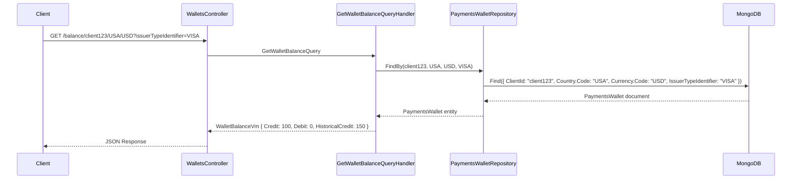

### Future TigerBeetle Flow
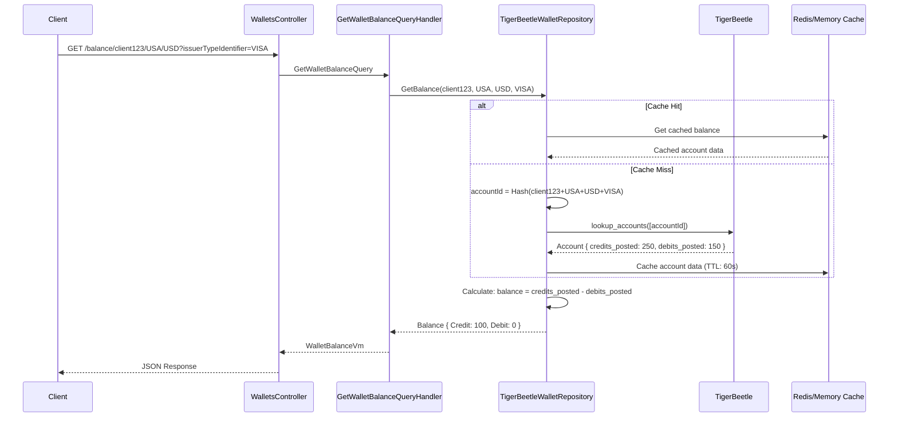

---

## 2. GetMultiBalance Operation

### Current MongoDB Flow
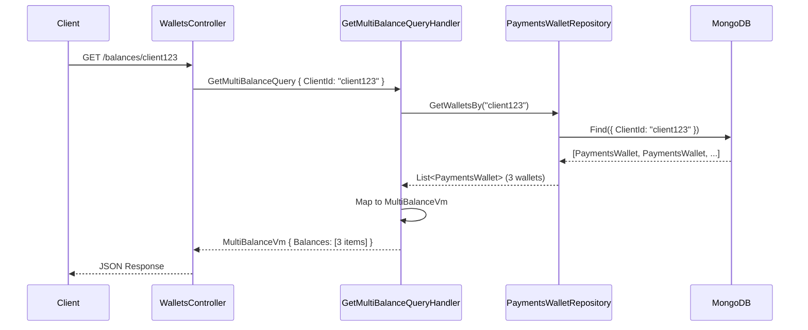

### Future TigerBeetle Flow
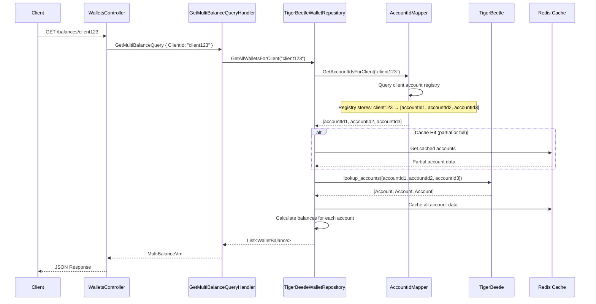

---

## 3. AddCredits Operation

### Current MongoDB Flow
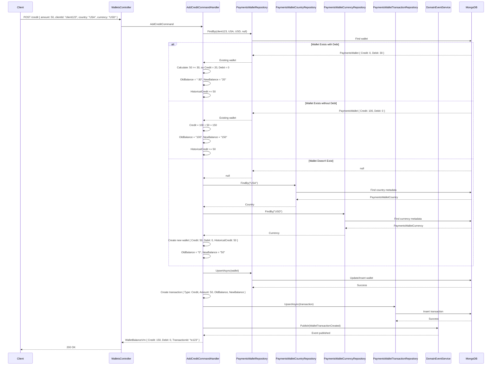

### Future TigerBeetle Flow
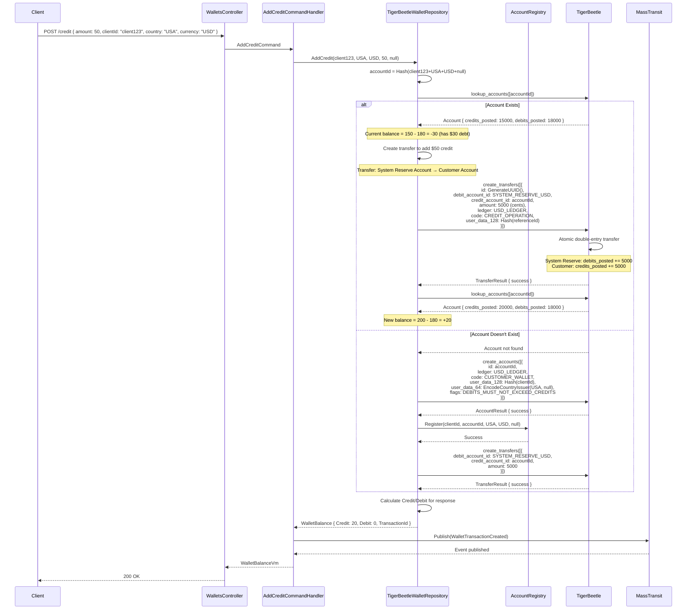

---

## 4. SubtractCredits (Debit) Operation

### Current MongoDB Flow
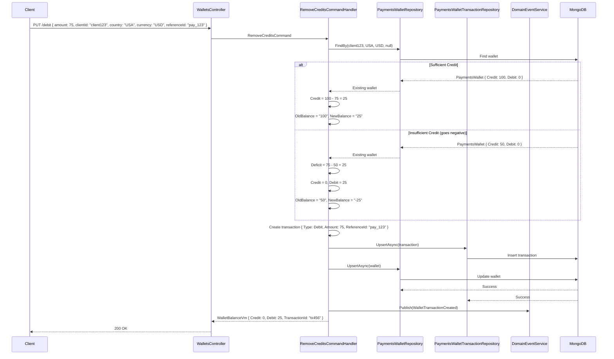

### Future TigerBeetle Flow
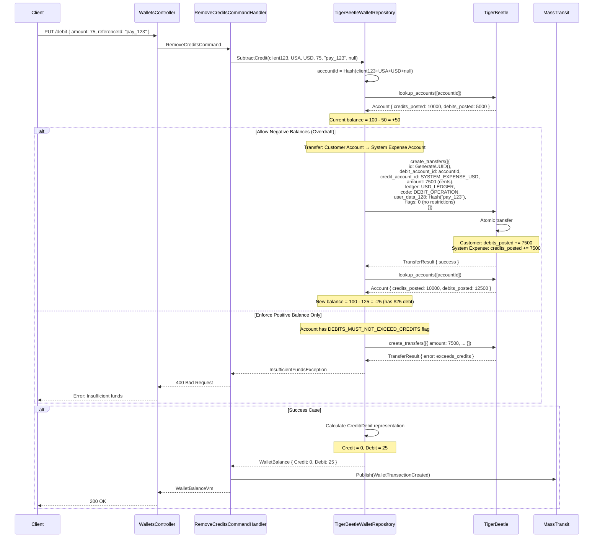

---

## 5. VoidTransaction Operation

### Current MongoDB Flow
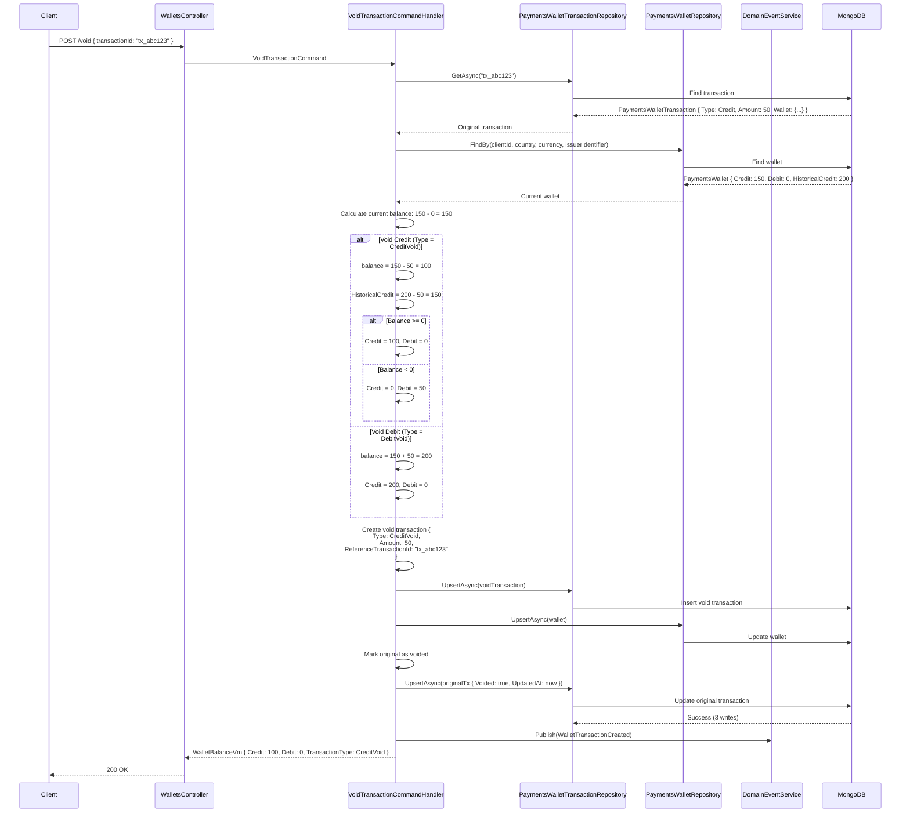

### Future TigerBeetle Flow
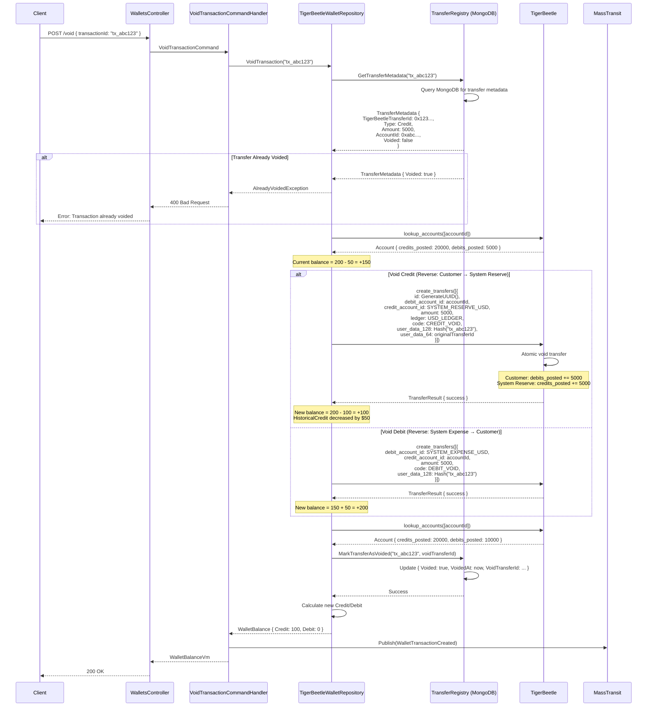

---

## Migration Strategy Diagrams

### Phase 1: Dual-Write Architecture
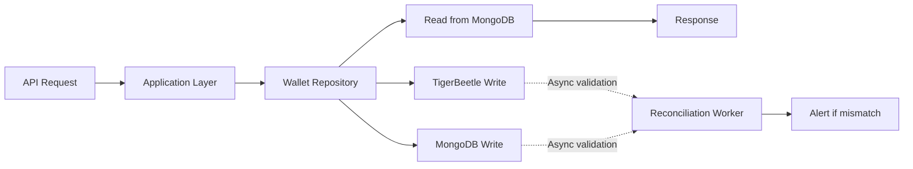

### Phase 2: Shadow Read Architecture
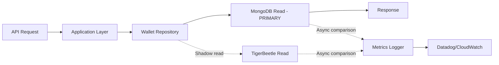

### Phase 3: Gradual Read Cutover
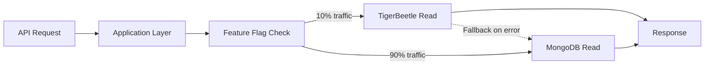

---

## Double-Entry Accounting Flows

### Add Credit Flow
```
System Reserve Account (Debit)     -$50
Customer Wallet (Credit)           +$50
────────────────────────────────────────
Net Balance Change:                  $0
```

### Subtract Credit (Debit) Flow
```
Customer Wallet (Debit)            -$30
System Expense Account (Credit)    +$30
────────────────────────────────────────
Net Balance Change:                  $0
```

### Void Credit Flow
```
Customer Wallet (Debit)            -$50
System Reserve Account (Credit)    +$50
────────────────────────────────────────
Net Balance Change:                  $0
```

### Void Debit Flow
```
System Expense Account (Debit)     -$30
Customer Wallet (Credit)           +$30
────────────────────────────────────────
Net Balance Change:                  $0
```

---

## Account Structure Diagram

```mermaid
graph TB
    subgraph "USD Ledger (Ledger ID: 1)"
        SR[System Reserve Account<br/>Code: 2000<br/>Credits: 0<br/>Debits: Posted credits given to customers]
        SE[System Expense Account<br/>Code: 3000<br/>Credits: Posted debits from customers<br/>Debits: 0]

        C1[Customer Wallet 1<br/>ID: Hash(client123+USA+USD)<br/>Credits Posted: Total added<br/>Debits Posted: Total spent]
        C2[Customer Wallet 2<br/>ID: Hash(client456+USA+USD)<br/>Credits Posted: Total added<br/>Debits Posted: Total spent]
    end

    subgraph "MXN Ledger (Ledger ID: 3)"
        SR2[System Reserve Account<br/>Code: 2000]
        SE2[System Expense Account<br/>Code: 3000]
        C3[Customer Wallet 3<br/>ID: Hash(client123+MEX+MXN)<br/>Credits Posted: Total added<br/>Debits Posted: Total spent]
    end

    SR -->|Add Credit Transfer| C1
    C1 -->|Debit Transfer| SE
    SR -->|Void Credit Transfer| C1
    SE -->|Void Debit Transfer| C1

    style SR fill:#90EE90
    style SR2 fill:#90EE90
    style SE fill:#FFB6C1
    style SE2 fill:#FFB6C1
    style C1 fill:#87CEEB
    style C2 fill:#87CEEB
    style C3 fill:#87CEEB
```

---

## Data Mapping Diagram

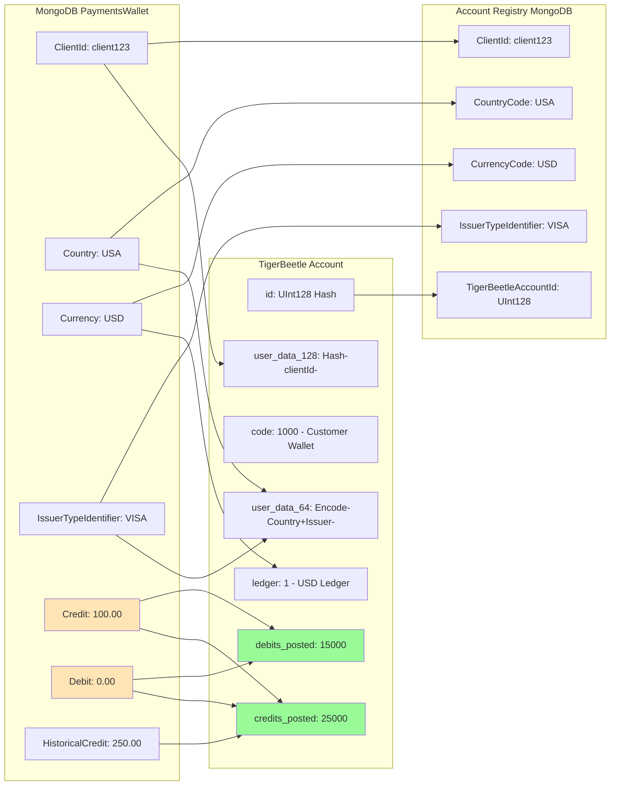

**Calculation:**
- MongoDB Balance: `Credit - Debit = 100 - 0 = $100`
- TigerBeetle Balance: `(credits_posted - debits_posted) / 100 = (25000 - 15000) / 100 = $100`
- MongoDB HistoricalCredit: `250.00`
- TigerBeetle HistoricalCredit: `credits_posted / 100 = 25000 / 100 = $250`

---

**Document Version:** 1.0
**Last Updated:** 2025-11-18
**Related:** TIGERBEETLE_WALLET_MIGRATION.md